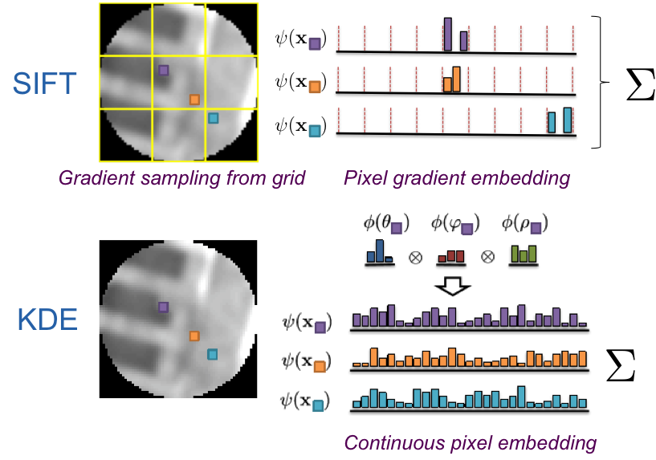

# KDE - Kernel Local Descriptors

This is a Matlab package the implements the kernel local descriptors presented in "Kernel Local Descriptors with Implicit Rotation Matching" at ICMR 2015 <https://hal.inria.fr/hal-01145656>. 



## What is it?
This code implements:

1. Extraction of our local descriptor
2. Descriptor post-processing (power-law and PCA dimensionality reduction)
3. Evaluation on the Brown patch dataset

## Execution
1) Run the following script:

```
>> extract
>> evaluate
```

## Performance
False Positive Rate at 95% recall on Brown patch dataset:

|Train set | Test set | RootSIFT (128d) | RootSIFT-PCA (80d) | KDE_{3,2,2}-PCA (80d) |
|:---:|:---:|:---:|:---:|:---:|
|notredame | liberty| 29.64 | 19.34| 11.73|
|yosemite |liberty | 29.64| 19.95 |12.42 |
|notredame | yosemite | 26.69| 18.37|7.17 |
|liberty | yosemite| 26.69| 19.52| 8.39|
|liberty | notredame | 22.06|13.90 | 5.09|
|yosemite |notredame | 22.06| 13.98| 5.19|


## Citation

If you use this work please cite our publication  "Kernel Local Descriptors with Implicit Rotation Matching" from ICMR 2015 <https://hal.inria.fr/hal-01145656>: 

```
@inproceedings{Bursuc15,
  title     = {Kernel Local Descriptors with Implicit Rotation Matching},
  author    = {Bursuc, Andrei and Tolias, Giorgos and J{\'e}gou, Herv{\'e}},
  booktitle = {ACM International Conference on Multimedia Retrieval},
  year      = {2015},
  url       = {https://hal.inria.fr/hal-01145656}
}
```
